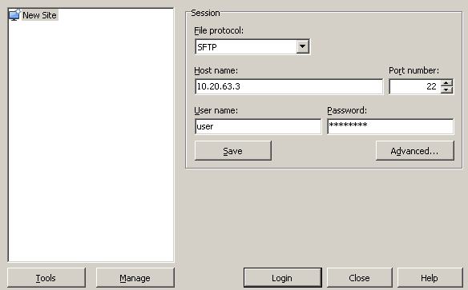

Файловых доступ к ресурсу осуществляется по протоколу SFTP. Однако в целях повышения безопасности, доступ к серверу осуществляется через шлюзовый SSH-сервер. Таким образом предлагается использовать технологию «port forward» для доступа к серверу, которую многие клиенты (например WinSCP) поддерживают «из коробки».

Для настройки WinSCP необходимо выполнить следующие пункты:

1. Установить и запустить [WinSCP](https://winscp.net/eng/download.php)

2. Нажать на кнопку «Advanced».
 

3. Нажать подраздел «Tunnel» в разделе «Connection», ввести следующие значения:
 - Connect through SSH tunnel
 - Host name: www.ut.mephi.ru
 - Port number: 22
 - User name: _почтовый логин (от @mephi.ru) строчными буквами_
 - Password: _почтовый пароль (от @mephi.ru)_

 И нажать «ОК»

 

4. Ввести следующие значения:
 - SFTP
 - Host name: _адрес сервера за шлюзом_
 - Port number: 22
 - User name: _SFTP/SSH логин к серверу_
 - Password: _SFTP/SSH пароль к серверу_

 

5. Нажать «Save As…» и «ОК»

 \

6. Нажать «Login»
